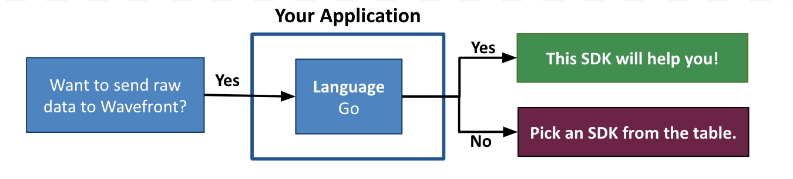

# wavefront-sdk-go [![build status][ci-img]][ci] [![Go Report Card][go-report-img]][go-report] [![GoDoc][godoc-img]][godoc]

## Table of Content
* [Prerequisites](#Prerequisites)
* [Set Up a Sender](#set-up-a-sender)
* [Send Data to Wavefront](#send-data-to-wavefront)
* [Close the Sender](#close-the-sender)
* [License](#License)
* [How to Get Support and Contribute](#how-to-get-support-and-contribute)

# Welcome to the Wavefront Go SDK

Wavefront by VMware Go SDK lets you send raw data from your Go application to Wavefront using a `Sender` interface. The data is then stored as metrics, histograms, and trace data. This SDK is also called the Wavefront Sender SDK for Go. 

Although this library is mostly used by the other Wavefront Go SDKs to send data to Wavefront, you can also use this SDK directly. For example, you can send data directly from a data store or CSV file to Wavefront.

**Before you start implementing, let us make sure you are using the correct SDK!**



> ***Note***:
> </br>
>   * **This is the Wavefront by VMware SDK for Go (Wavefront Sender SDK for Go)!**
>   If this SDK is not what you were looking for, see the [table](#wavefront-sdks) below.

#### Wavefront SDKs
<table id="SDKlevels" style="width: 100%">
<tr>
  <th width="10%">SDK Type</th>
  <th width="45%">SDK Description</th>
  <th width="45%">Supported Languages</th>
</tr>

<tr>
  <td><a href="https://docs.wavefront.com/wavefront_sdks.html#sdks-for-collecting-trace-data">OpenTracing SDK</a></td>
  <td align="justify">Implements the OpenTracing specification. Lets you define, collect, and report custom trace data from any part of your application code. <br>Automatically derives Rate Errors Duration (RED) metrics from the reported spans. </td>
  <td>
    <ul>
    <li>
      <b>Java</b>: <a href ="https://github.com/wavefrontHQ/wavefront-opentracing-sdk-java">OpenTracing SDK</a> <b>|</b> <a href ="https://github.com/wavefrontHQ/wavefront-opentracing-bundle-java">Tracing Agent</a>
    </li>
    <li>
      <b>Python</b>: <a href ="https://github.com/wavefrontHQ/wavefront-opentracing-sdk-python">OpenTracing SDK</a>
    </li>
    <li>
      <b>Go</b>: <a href ="https://github.com/wavefrontHQ/wavefront-opentracing-sdk-go">OpenTracing SDK</a>
    </li>
    <li>
      <b>.Net/C#</b>: <a href ="https://github.com/wavefrontHQ/wavefront-opentracing-sdk-csharp">OpenTracing SDK</a>
    </li>
    </ul>
  </td>
</tr>

<tr>
  <td><a href="https://docs.wavefront.com/wavefront_sdks.html#sdks-for-collecting-metrics-and-histograms">Metrics SDK</a></td>
  <td align="justify">Implements a standard metrics library. Lets you define, collect, and report custom business metrics and histograms from any part of your application code.   </td>
  <td>
    <ul>
    <li>
    <b>Java</b>: <a href ="https://github.com/wavefrontHQ/wavefront-dropwizard-metrics-sdk-java">Dropwizard</a> <b>|</b> <a href ="https://github.com/wavefrontHQ/wavefront-runtime-sdk-jvm">JVM</a>
    </li>
    <li>
    <b>Python</b>: <a href ="https://github.com/wavefrontHQ/wavefront-pyformance">Pyformance SDK</a>
    </li>
    <li>
      <b>Go</b>: <a href ="https://github.com/wavefrontHQ/go-metrics-wavefront">Go Metrics SDK</a>
      </li>
    <li>
    <b>.Net/C#</b>: <a href ="https://github.com/wavefrontHQ/wavefront-appmetrics-sdk-csharp">App Metrics SDK</a>
    </li>
    </ul>
  </td>
</tr>

<tr>
  <td><a href="https://docs.wavefront.com/wavefront_sdks.html#sdks-that-instrument-frameworks">Framework SDK</a></td>
  <td align="justify">Reports predefined traces, metrics, and histograms from the APIs of a supported app framework. Lets you get started quickly with minimal code changes.</td>
  <td>
    <ul>
    <li><b>Java</b>:
    <a href="https://github.com/wavefrontHQ/wavefront-dropwizard-sdk-java">Dropwizard</a> <b>|</b> <a href="https://github.com/wavefrontHQ/wavefront-gRPC-sdk-java">gRPC</a> <b>|</b> <a href="https://github.com/wavefrontHQ/wavefront-jaxrs-sdk-java">JAX-RS</a> <b>|</b> <a href="https://github.com/wavefrontHQ/wavefront-jersey-sdk-java">Jersey</a></li>
    <li><b>.Net/C#</b>:
    <a href="https://github.com/wavefrontHQ/wavefront-aspnetcore-sdk-csharp">ASP.Net core</a> </li>
    <!--- [Python](wavefront_sdks_python.html#python-sdks-that-instrument-frameworks) --->
    </ul>
  </td>
</tr>

<tr>
  <td><a href="https://docs.wavefront.com/wavefront_sdks.html#sdks-for-sending-raw-data-to-wavefront">Sender SDK</a></td>
  <td align="justify">Lets you send raw data to Wavefront for storage as metrics, histograms, or traces, e.g., to import CSV data into Wavefront.
  </td>
  <td>
    <ul>
    <li>
    <b>Java</b>: <a href ="https://github.com/wavefrontHQ/wavefront-sdk-java">Sender SDK</a>
    </li>
    <li>
    <b>Python</b>: <a href ="https://github.com/wavefrontHQ/wavefront-sdk-python">Sender SDK</a>
    </li>
    <li>
    <b>Go</b>: <a href ="https://github.com/wavefrontHQ/wavefront-sdk-go">Sender SDK</a>
    </li>
    <li>
    <b>.Net/C#</b>: <a href ="https://github.com/wavefrontHQ/wavefront-sdk-csharp">Sender SDK</a>
    </li>
    <li>
    <b>C++</b>: <a href ="https://github.com/wavefrontHQ/wavefront-sdk-cpp">Sender SDK</a>
    </li>
    </ul>
  </td>
</tr>

</tbody>
</table>

## Prerequisites
* Go 1.9 or higher.
* Import the `senders` package.
    ```go
    import (
        wavefront "github.com/wavefronthq/wavefront-sdk-go/senders"
    )
    ```

## Set Up a Sender

You can send metrics, histograms, or trace data from your application to the Wavefront service using a Wavefront proxy or direct ingestions.

* Option 1: Use a [**Wavefront proxy**](https://docs.wavefront.com/proxies.html), which then forwards the data to the Wavefront service. This is the recommended choice for a large-scale deployment that needs resilience to internet outages, control over data queuing and filtering, and more.
[Create a ProxyConfiguration](#option-1-sending-data-via-the-wavefront-proxy) to send data to a Wavefront proxy.
  
* Use [**direct ingestion**](https://docs.wavefront.com/direct_ingestion.html) to send the data directly to the Wavefront service. This is the simplest way to get up and running quickly.
[Create a DirectConfiguration](#option-2-sending-data-via-direct-ingestion) to send data directly to a Wavefront service.
  
### Option 1: Sending Data via the Wavefront Proxy
Depending on the data you wish to send to Wavefront (metrics, distributions (histograms) and/or spans), enable the relevant ports on the proxy and initialize the proxy sender.

```go
import (
    wavefront "github.com/wavefronthq/wavefront-sdk-go/senders"
)

func main() {
    proxyCfg := &wavefront.ProxyConfiguration {
        Host : "proxyHostname or proxyIPAddress",

        // At least one port should be set below.
        MetricsPort         : 2878,    // set this (typically 2878) to send metrics
        DistributionPort    : 2878,   // set this (typically 2878) to send distributions
        TracingPort         : 30000, // set this to send tracing spans. the same port as the customTracingListenerPorts configured in the wavefront proxy
        FlushIntervalSeconds: 10,   // flush the buffer periodically, defaults to 5 seconds.
    }

    sender, err := wavefront.NewProxySender(proxyCfg)
    if err != nil {
        // handle error
    }
    // send data (see below for usage)
    
    time.Sleep(5 * time.Second)
	sender.Flush()
	sender.Close()
}
```

### Option 2: Sending Data via Direct Ingestion

```go
import (
    wavefront "github.com/wavefronthq/wavefront-sdk-go/senders"
)

func main() {
    directCfg := &wavefront.DirectConfiguration {
        Server : "https://INSTANCE.wavefront.com", // your Wavefront instance URL
        Token : "YOUR_API_TOKEN",                  // API token with direct ingestion permission

        // Optional configuration properties. Default values should suffice for most use cases.
        // override the defaults only if you wish to set higher values.

        // max batch of data sent per flush interval. defaults to 10,000.
        // recommended not to exceed 40,000.
        BatchSize : 10000,

        // size of internal buffer beyond which received data is dropped.
        // helps with handling brief increases in data and buffering on errors.
        // separate buffers are maintained per data type (metrics, spans and distributions)
        // defaults to 50,000. higher values could use more memory.
        MaxBufferSize : 50000,

        // interval (in seconds) at which to flush data to Wavefront. defaults to 1 Second.
        // together with batch size controls the max theoretical throughput of the sender.
        FlushIntervalSeconds : 1,
    }

    sender, err := wavefront.NewDirectSender(directCfg)
    if err != nil {
        // handle error
    }
    // send data (see below for usage)
    
    time.Sleep(5 * time.Second)
    sender.Flush()
    sender.Close()
}

```

## Send Data to Wavefront

Wavefront supports different metric types, such as gauges, counters, delta counters, histograms, traces, and spans. See [Metrics](https://docs.wavefront.com/metric_types.html) for details. To send data to Wavefront using `Sender` you need to instantiate the following:
 * [Metrics and Delta Counters](#Metrics-and-Delta-Counters)
 * [Distributions (Histograms)](#distributions-histograms)
 * [Tracing Spans](#Tracing-Spans)

#### Metrics and Delta Counters

```go
// Wavefront metrics data format
// <metricName> <metricValue> [<timestamp>] source=<source> [pointTags]
// Example: "new-york.power.usage 42422 1533529977 source=localhost datacenter=dc1"
sender.SendMetric("new-york.power.usage", 42422.0, 0, "go_test", map[string]string{"env" : "test"})

// Wavefront delta counter format
// <metricName> <metricValue> source=<source> [pointTags]
// Example: "lambda.thumbnail.generate 10 source=thumbnail_service image-format=jpeg"
sender.SendDeltaCounter("lambda.thumbnail.generate", 10.0, "thumbnail_service", map[string]string{"format" : "jpeg"})
```

***Note***: If your `metricName` has a bad character, that character is replaced with a `-`.

#### Distributions (Histograms)

```go
import "github.com/wavefronthq/wavefront-sdk-go/histogram"

// Wavefront Histogram data format
// {!M | !H | !D} [<timestamp>] #<count> <mean> [centroids] <histogramName> source=<source> [pointTags]
// Example: You can choose to send to at most 3 bins - Minute/Hour/Day
// "!M 1533529977 #20 30.0 #10 5.1 request.latency source=appServer1 region=us-west"
// "!H 1533529977 #20 30.0 #10 5.1 request.latency source=appServer1 region=us-west"
// "!D 1533529977 #20 30.0 #10 5.1 request.latency source=appServer1 region=us-west"

centroids := []histogram.Centroid {
      {
        Value : 30.0,
        Count : 20,
      },
      {
        Value : 5.1,
        Count : 10,
      },
}

hgs := map[histogram.Granularity]bool {
    histogram.MINUTE : true,
    histogram.HOUR   : true,
    histogram.DAY    : true,
}

sender.SendDistribution("request.latency", centroids, hgs, 0, "appServer1", map[string]string {"region" : "us-west"})
```

#### Tracing Spans

When you use a Sender SDK, you won’t see span-level RED metrics by default unless you use the Wavefront proxy and define a custom tracing port (`TracingPort`). See [Instrument Your Application with Wavefront Sender SDKs](https://docs.wavefront.com/tracing_instrumenting_frameworks.html#instrument-your-application-with-wavefront-sender-sdks) for details.

```go
// Wavefront Tracing Span Data format
// <tracingSpanName> source=<source> [pointTags] <start_millis> <duration_milliseconds>
// Example:
// "getAllUsers source=localhost traceID=7b3bf470-9456-11e8-9eb6-529269fb1459
// spanID=0313bafe-9457-11e8-9eb6-529269fb1459 parent=2f64e538-9457-11e8-9eb6-529269fb1459
// application=Wavefront http.method=GET 1552949776000 343"

sender.SendSpan("getAllUsers", 1552949776000, 343, "localhost",
    "7b3bf470-9456-11e8-9eb6-529269fb1459",
    "0313bafe-9457-11e8-9eb6-529269fb1459",
    []string {"2f64e538-9457-11e8-9eb6-529269fb1459"},
    nil,
    []SpanTag {
        {Key : "application", Value : "Wavefront"},
        {Key : "http.method", Value : "GET"},
    },
    nil)
```
***Note:*** The tracing and span SDK APIs are designed to serve as low-level endpoints. For most use cases, we recommend using
the OpenTracing SDK with the `WavefrontTracer`.
* See the [Go OpenTracing project](https://github.com/opentracing/opentracing-go) for details. 
* To use OpenTracing with Wavefront, see the [Wavefront Go OpenTracing SDK](https://github.com/wavefrontHQ/wavefront-opentracing-sdk-go).

## Close the Sender
Before shutting down your application, flush the buffer and close the sender.

```go
// failures observed while sending metrics/histograms/spans, can be obtained as follows:
totalFailures := sender.GetFailureCount()

// on-demand buffer flush
sender.Flush()

// close the sender before shutting down your application
sender.Close()
```

## License
[Apache 2.0 License](LICENSE).

## How to Get Support and Contribute

* Reach out to us on our public [Slack channel](https://www.wavefront.com/join-public-slack).
* If you run into any issues, let us know by creating a GitHub issue.

[ci-img]: https://travis-ci.com/wavefrontHQ/wavefront-sdk-go.svg?branch=master
[ci]: https://travis-ci.com/wavefrontHQ/wavefront-sdk-go
[godoc]: https://godoc.org/github.com/wavefrontHQ/wavefront-sdk-go/senders
[godoc-img]: https://godoc.org/github.com/wavefrontHQ/wavefront-sdk-go/senders?status.svg
[go-report-img]: https://goreportcard.com/badge/github.com/wavefronthq/wavefront-sdk-go
[go-report]: https://goreportcard.com/report/github.com/wavefronthq/wavefront-sdk-go
